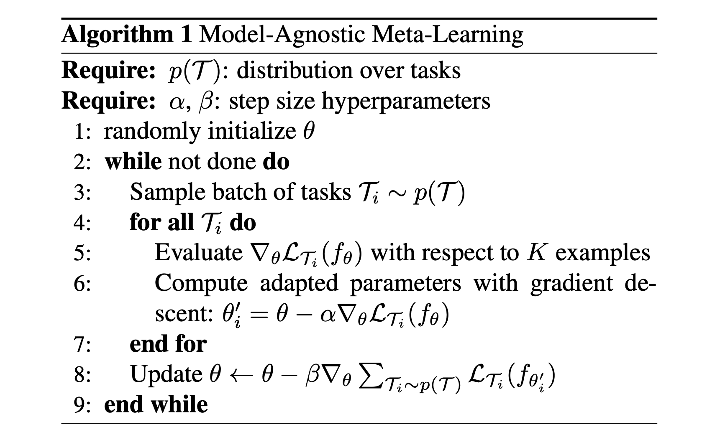
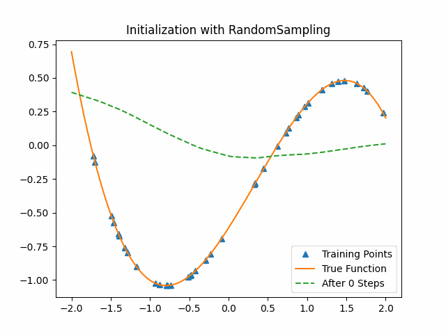
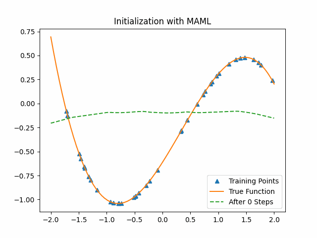
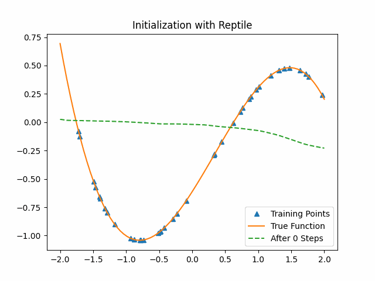
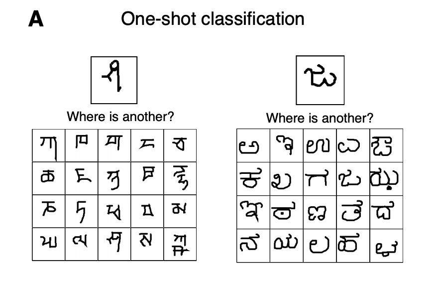
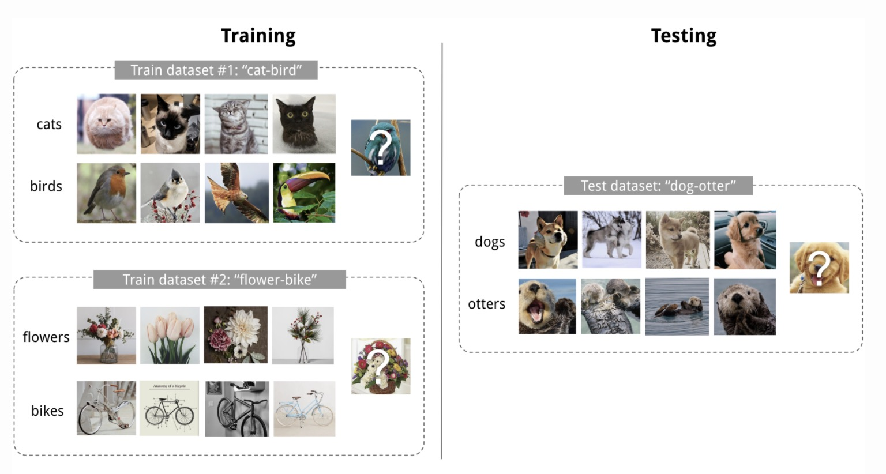
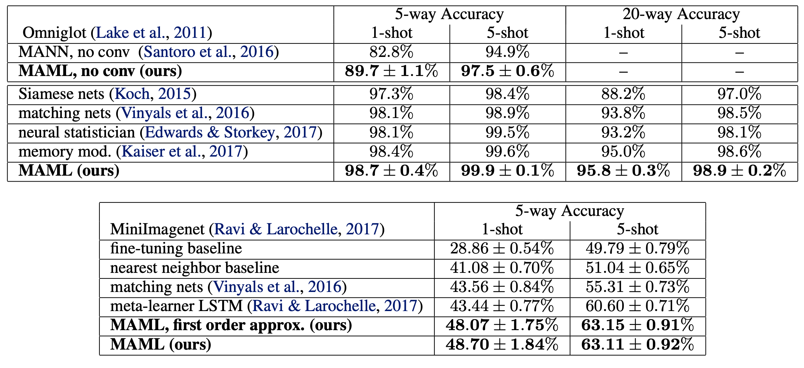
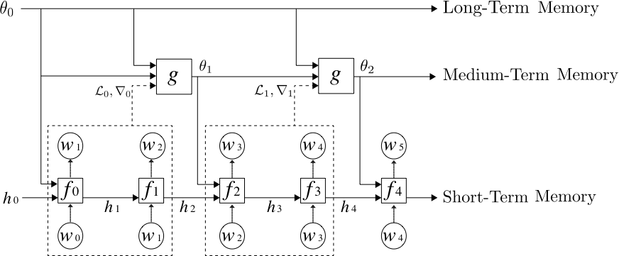
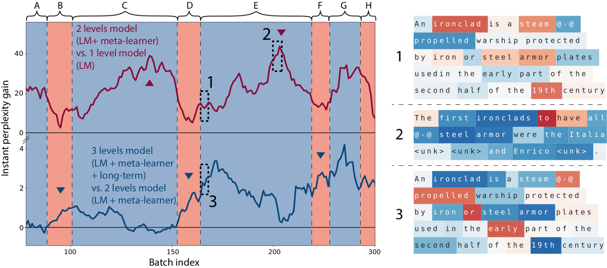

This is a blog post credit to Yushu Pan, Bowen Gao, Haoshuai Zhou

# Meta-learning: A Learning to Learn Approach
### Brief Introduction of Learning to Learn
The success of modern deep learning algorithms is remarkable. However, this kind of success is based on the huge datasets that are available to be used to train the model. For example, advanced deep learning  language models, like [gpt-2](https://d4mucfpksywv.cloudfront.net/better-language-models/language-models.pdf), is pre-trained with around 40GB of text data. 

This kind of method of training a model from scratch can achieve excellent performance when there are abundant train data available. However, in many areas, the size of training data is limited, such as media image analysis. Also, when the new task we want to tackle is relevant to the previous task we have solved, it is not reasonable to train from scratch.   

On the other hand, humans can use their past experience to learn new things quickly. Babies have to learn everything from scratch, like how to walk, how to talk, etc. However, as the babies grow up, they will get the ability to use what they have learned before to learn new tasks. For example, people who know how to play Go can learn how to play chess very fast. This kind of ability is called "learning to learn", and we want to build a machine learning model that also has such ability.

### What is Meta learning

The idea of meta-learning is to learn the learning process. There are many types of meta-learning and this blog will focus on two methods which try to learn some hyperparameters (such as initialization parameters, learning rates) by learning from previous tasks. Other types meta-learning will be mentined in the last part. Basically, we will have two modules in meta-learning models. The first module is the same as a typical neural network and it can be regarded as a low-level network. Sometimes it called learner and optimizee. The second module is a higher level one called optimizer or meta-learner. It tries to teach learner to learn better.

Since the number of learning tasks is more than one, before describing the algorithm, we first clarify the training sets and test sets in our problem. The training set consists of several tasks and the test set has distinguished tasks to evaluate the model. In each task, there are training data called support set and test data called query data for the low-level network. Then we will present two meta-learning models: MAML and Reptile.

### MAML or Reptile
#### MAML
We will first introduce "Model-Agnostic Meta-Learning for Fast Adaptation of Deep Networks" (abbreviated as **MAML**). The pseudo-code from the [original paper](https://arxiv.org/abs/1703.03400) is as following, we modify the name of parameters to make it clear.

As a meta-learning algorithm, MAML focuses on learning best initialization values $\mathrm \Theta$ for parameters $\theta$ of a neural network $f$.  Suppose we have a task set $\{\Gamma_i\}_{i = 1}^M$and each task has $K$ examples. In each epoch, we first random sample $n$ task sets to construct a task batch $\{\Gamma_j\}_{j = 1}^n$. After training the network $f$ on support sets of each task in the batch, we could get $n$ new models: $f_{\theta_1}, f_{\theta_2}, …, f_{\theta_n}$. The way to update parameters is:

$$\theta_j \Leftarrow \theta - \alpha \nabla_{\theta}{\mathcal L}_{\Gamma_j} (f_{\theta}),$$

where $\alpha$ is the learning rate and $\mathcal{L}$ is the loss function. Next, with the query set of each task in the batch, we update the initialization value $\Theta$ by SGD:

$$\Theta \Leftarrow \Theta - \beta \nabla \sum_{\Gamma_j}\mathcal{L}_{\Gamma_j}(f_{\theta_j})$$

Then we start our next epoch until convergence. 

#### Toy Examples

We provide a toy example below to demonstrate how MAML works and show its result.  Each task consists in learning a cubic function:

$$y = ax^3 + bx^2 + cx + d$$

Specifically, in task $\Gamma_i$, the ground truth is $a_ix^3+b_ix^2+c_ix+d_i$. The corresponding support sets have 40 random sampling data points $(x, y)$ and the query sets have 80 random sampling data points. The low-level model, cubic function neural network, consists of two hidden layers with 40 units. MAML cubic learning model sets batch size as 1, $\alpha$ as 0.01 and the outside optimizer as Adam optimizer. 

To compare MAML, we use a cubic function neural network with random initialization parameters to learn from the data. The following first figure shows the training process on the test set with the random initialization parameters. The second figure shows the training process on the same test set with the MAML initialization parameters. We can see that MAML initialization parameters are much better than random initialization. After the first epoch, MAML has already got a good result while the random-sampling method learn nothing.

#### Reptile

Now we come to the second meta-learning approach - Reptile. However, I don't know why this algorithm is called Reptile. Maybe it want to contact with Mammal :). The pseudo-code from the [original paper](https://pdfs.semanticscholar.org/672c/586880655dc544474280a6e086c1fc901c85.pdf) is as follows.

Reptile takes SGD for $k$ iterations on a given task to get the current parameters $\theta_1,\theta_2,..., \theta_n$, and then moves $\Theta$  in the direction of the parameters we obtained. We also give a similar toy example with Reptile. The lower level model is the same as the previous cubic function neural network and we set $k$ as 3.

As the figure shows, Reptile initialization is also better than random initialization. But we could not say Reptile is better than MAML.

### Few Shot Image Classification with Meta-learning

One important application of meta-learning is on the few-shot image classification tasks. Few-shot means for one class there are only a few examples. And we want the model to be able to learn a classifier with those limited examples. 

Generally, if there are n different classes and k samples in each class, we call it n-way  k-shot learning. The evaluation method for an n-way k-shot learning model is defined as follow:

Firstly, we give the model a support set containing n new classes that are unseen before. For each class there are k samples. Next, we give the model a query example that belongs to one of those n classes. And we want to see whether the model is able to decide which class this query example belongs to. 

Here is an example of 1-way 20-shot classification from [omniglot](https://github.com/brendenlake/omniglot) dataset.

								(image source: [The Omniglot challenge: a 3-year progress report](https://arxiv.org/pdf/1902.03477.pdf))

A training set in a few shot learning contains a support set and a query example.  After training on several training datasets, the algorithm will be tested with test datasets that contain new classes that are unseen before. Here is an example of a 2-way 4-shot classification task with the visualization of the training set and testing set.

										(image source: [Meta-Learning: Learning to Learn Fast](https://lilianweng.github.io/lil-log/2018/11/30/meta-learning.html))

MAML, The meta learning algorithm mentioned before, achieves outstanding classification accuracies in few-shot learning tasks. Here are the results from [original paper](https://arxiv.org/pdf/1703.03400v3.pdf).

As shown by [paperswithcode](https://paperswithcode.com/task/few-shot-image-classification), MAML is still the state of the art model for OMNIGLOT - 5-Shot learning task.

### Meta-learning In Natural Language Processing

The architecture of meta-learning has many similarities compared to the architecture of the Recurrent Neural Network. This kind of analogy is studied in this [paper](https://arxiv.org/abs/1803.10631).

One major problem of natural language models is the hardness of learning the long-term relationships within a long sequence. Time-series models like RNN and LSTM use memory to store the information from the previous sequence. 

The meta learner works very similarly to those time-series models. During the training, the meta-learner takes a sequence of parameters and gradients from models as inputs, and produces a sequence of updated model parameters as output. The author of the paper [Meta-Learning a Dynamical Language Model](https://arxiv.org/abs/1803.10631) uses this kind of analogy to implement a method that applies meta-learner as a medium-term memory in deep learning language models.  Here is the architecture of the model they build:

This meta-learning model has three levels of memory network. The bottom level is the standard LSTM that stores the short-term memory. The medium level is the meta learner represented as ***g*** that updates the parameters of the LSTM and acts like the medium-term memory storage network. On the top level, it stores the long-term static memory.

The result of this model is shown below.

The task is about predicting the words of a Wikipedia article given the beginning. Here A, B, C ..., H are successive Wikipedia articles. The curves show the difference in instant perplexity between models. The red curve is the difference between the 2 levels model (LSTM + meta-learner) and 1 level model (only standard LSTM). A positive value means the 2 levels model achieves a lower perplexity locally compared to the 1 level model. In NLP tasks, the lower the perplexity, the better. Because of the ability of meta-learner to memorize medium-term memory, we can see that perplexity difference is gradually increased during the processing of article C and article E. That means the 2 levels model performs better and better along with the article. On the right side, 1 and 2 are captured from the red curve. The difference is that, 1 is captured at the beginning of the article E, and 2 is captured from the middle of the article E.  For each token, blue color means 2 levels model has a smaller token loss than the 1 level model, while red color indicates the 2 levels model has a larger token loss than the 1 level model. As we can see, compared to tokens in 1, most of tokens in 2 are blue. That also shows that the meta learner in the 2 levels model help to increase the performance as the model reads through the article. 

### Final Thoughts

Since MAML and Reptile only focus on finding the best initialization of a neural network, they have obvious limitations. The core updating way of both methods is "gradient by gradient", which is hard to apply in other hyperparameters tuning, such as network structures and learning rates. In addition, MAML and Reptile also have random initialization part. They randomly initialize the initialization of parameters, namely $\Theta$. 

Furthermore, there are different types in meta-learning. 

* Optimizer Meta-Learning

  The goal of optimizer meta-learning algorithms is to find a better baseline model to learn several tasks. These approaches are typically recurrent networks so that they can remember how it previously updated the learner model. These optimizers could be trained by supervised learning and [reinforcement learning](https://cpb-us-e1.wpmucdn.com/sites.usc.edu/dist/6/250/files/2018/11/schweighofer2003-1-20aiemr.pdf).  Especially, MAML and Reptiles are kinds of optimizer meta-learning algorithm not related to network structure.

* Metric Meta-Learning

  These approaches learn a metric space in which learning is particularly efficient. When we have some examples such as images, we want to find a reasonable metric to measure the distance between different examples. However, due to the small number of data, metric meta-learning could be a good way to learn a better measurement.

* Recurrent Model Meta-Learning

  Some recurrent neural network, such as [LSTM](http://www.bioinf.jku.at/publications/older/2604.pdf), plays an important role in meta-learning. In a classification problem, we also can reform these dataset as a data stream to our network. [Meta reinforcement learning](https://arxiv.org/pdf/1904.00956.pdf) is one of this approach.

